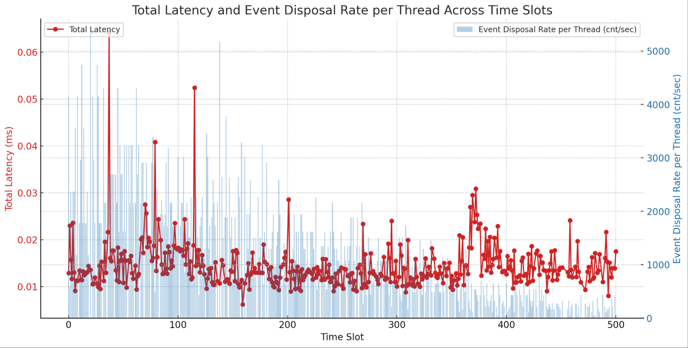
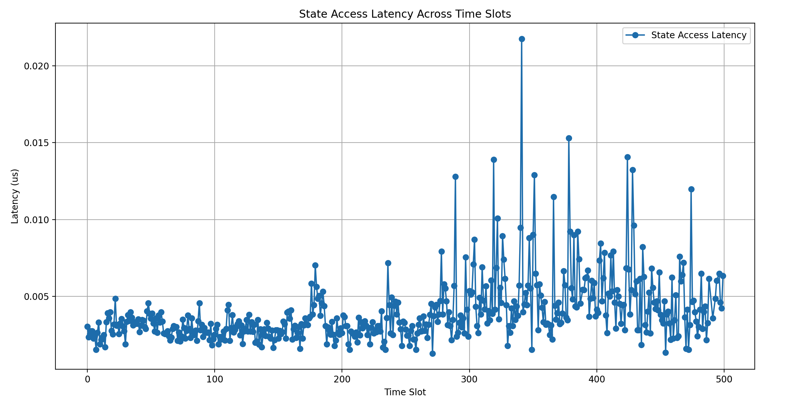
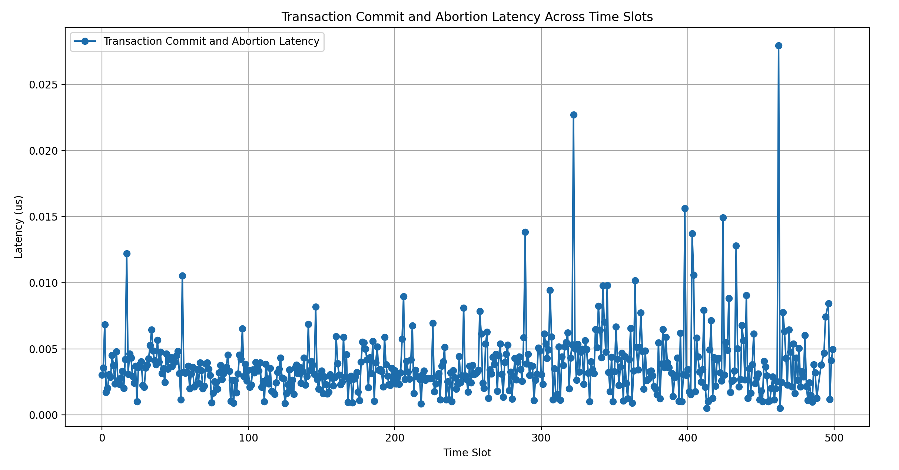

# DB4NFV [^1]
A TSPE (Transactional Streaming Processing Engine) Designed for NFV (Network Function Virtualization)

This is a framework for users to develop high-performance, scalable and cross-flow VNFs. It's aimed at using light-weighted ACID transaction to provide robustness and easy coding for complex network programming.

Especially, it's optimized to solve the case VNF needs to heavily read & write cross-flow states that usually require heavy locking mechanism, which could be really slowed down and dangerous for network fundamentals.

By design, it should support any runtime fulfilling the interface. Here we are using modified libVNF as runtime [^2].


# Performance 

Overview:

- Total Latency (Transaction received - Transaction Commit / Aborted)

- Transaction Request handing rates / (second * thread).



Stage: Latency for an event finish all its needed states.



Stage: Handle commitment and abortion of transactions.




# Installation

Requirements:
- Rust compiler. (Tested on 1.76.0)
- g++ compiler. (Tested on 7.5.0)
- Linux kernel. (Tested on ubuntu 18.04)

Get repository:

```bash
git clone --recurse-submodules https://github.com/Kailian-Jacy/DB4NFV	

cd DB4NFV
```

Compile source:
```bash
cargo build --release
```

Config json configurations to project root directory:
```bash
cat <<EOF > config.json 
{
  "vnf_threads_num": 3,
  "worker_threads_num": 3,
  "waiting_queue_size": 4096,
  "transaction_out_of_order_time_ns": 100,
  "ringbuffer_size": 10000,
  "ringbuffer_full_to_panic": false,
  "transaction_pooling_size": 10000,
  "max_state_records": 10000,
  "verbose": true,
  "monitor_enabled": true,
  "log_dir": "./perf"
}
EOF
```

To run this system, make sure you have
 `$vnf_threads_num + $worker_threads_num + 1 [+1 (if monitor enabled)]` 
 bindable cores. 

Example VNF is under `DB4NFV/runtime/SL` directory. Configuration for such VNF are also under that directory. Like port to expose etc.

```csv
bufferSize,128
dataStoreThreshold,131072
coreNumbers,3
dataStoreSocketPath,/home/kailian/libVNF/vnf/tmp/
dataStoreFileNames,1
dataStoreIP,127.0.0.1
dataStorePort,9090
serverIP,127.0.0.1
serverPort,9090
reuseMode,1
debug,true
monitorInterval,200
```


Run with:
```bash
./target/release/DB4NFV
```

It may take some seconds to spawn.

Send test request from another terminal:
```
python3 ./runtime/vnf/SL/testbench_sender.py
```

# Develop VNF

To develop a new VNF, you are to interact with interfaces list in `runtime/include/core.hpp`. `runtime/vnf/SL/sl.cpp` serves as an quick example.

## Example with SL

SL describes a situation from bank. We have thousands of bank accounts and system needs to operate on their balance. 

So there are two kinds of transaction provided to be requested: 

One is about `deposit(amount)`:

```json
"deposit_transaction":
{
	"read": ["balance"], // We need to read original balance.
	"write": "balance",  // We will write new balance.
	deposit_handlefunc,  // Handle function to perform on them.
}
```

Another is `transfer(from,to,amount)`:
```json
"transfer_transaction":
{
	[
		{
			"event": "src_transfer_sa",
			"reads": ["balance"], // read original balance.
			"write": "balance",  // Write new balance.
			src_transfer_handlefunc
		},
		{
			"event": "dst_receive_sa",
			"reads": ["balance"], // read original balance.
			"write": "balance",  // Write new balance.
			dest_receive_handlefunc
		}
	]
}
```

And define the corresponding logic to each handle function to complete the logic. The function works in `y = f(x1, x2, x3...)` style. Namely, you read multiple states in, and write one state.

Here is the example of deposit handler:

```C++
int deposit_sa_udf(vnf::ConnId& connId, Context &ctx, char * raw, int length)
{
	auto threadLocal = reinterpret_cast<BState *>(ctx.reqObj()); // Read from thread local to fetch prepared state.
    if (length < 4){ // Abort when something is wrong.
        ctx.Abort();
        return -1;
    }
    int* srcBalance = ctx.get_value(raw, length, 0); // Fetch cross-flow state from state engine.
    return *srcBalance - threadLocal->amount; // Perform calculation and return.
}
```

You handle:

1. Illegal situation that make your function request an `abortion`. This abortion request will make the whole transaction to revert back.
2. Get state from either thread local or state engine. Here `amount` to deposit is known to your own, and real-time `balance` of your account is recorded remotely in state engine.
3. Calculate and return value you want to write.

All things done! You are ready to go!

# Thinkings During This Project

For more information see: *https://kailian.notion.site/DB4NFV-An-Transactional-Streaming-Processing-Engine-for-NFV-Racing-States-7ac42ee28c7f475897b02626541940cd?pvs=4*

- User guide.
- Development considerations.
- What to learn from this project.

[^1]: Promoted from MorphStream/DB4NFV: *https://github.com/intellistream/MorphStream/tree/DB4NFV*

[^2]: VNF runtime part promoted from libVNF: *https://github.com/networkedsystemsIITB/libVNF*